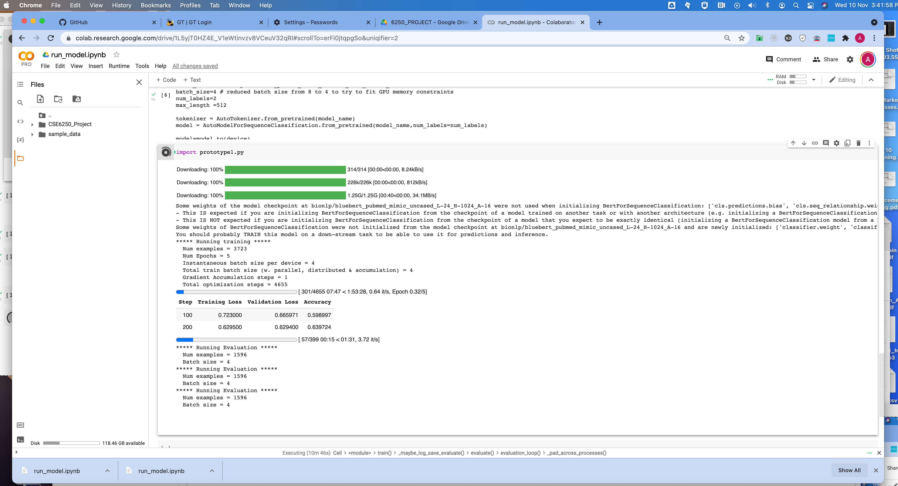

# CSE6250_Project

## Data setup
Daniel : I've set up a directory `physionet.org` that contains all the MIMIC3 data files like so.
```
.
├── README.md
├── Useful_resources.txt
└── physionet.org
    ├── files
    │   └── mimiciii
    │       └── 1.4
    │           ├── ADMISSIONS.csv.gz
    │           ├── CALLOUT.csv.gz
    │           ├── CAREGIVERS.csv.gz
    │           ├── CHARTEVENTS.csv.gz
    │           ├── CPTEVENTS.csv.gz
    │           ├── DATETIMEEVENTS.csv.gz
    │           ├── DIAGNOSES_ICD.csv.gz
    │           ├── DRGCODES.csv.gz
    │           ├── D_CPT.csv.gz
    │           ├── D_ICD_DIAGNOSES.csv.gz
    │           ├── D_ICD_PROCEDURES.csv.gz
    │           ├── D_ITEMS.csv.gz
    │           ├── D_LABITEMS.csv.gz
    │           ├── ICUSTAYS.csv.gz
    │           ├── INPUTEVENTS_CV.csv.gz
    │           ├── INPUTEVENTS_MV.csv.gz
    │           ├── LABEVENTS.csv.gz
    │           ├── LICENSE.txt
    │           ├── MICROBIOLOGYEVENTS.csv.gz
    │           ├── NOTEEVENTS.csv.gz
    │           ├── OUTPUTEVENTS.csv.gz
    │           ├── PATIENTS.csv.gz
    │           ├── PRESCRIPTIONS.csv.gz
    │           ├── PROCEDUREEVENTS_MV.csv.gz
    │           ├── PROCEDURES_ICD.csv.gz
    │           ├── README.md
    │           ├── SERVICES.csv.gz
    │           ├── SHA256SUMS.txt
    │           ├── TRANSFERS.csv.gz
    │           └── index.html
    └── robots.txt
```
To set up the same locally run this command and fill in your physionet password when prompted.
`wget -r -N -c -np --user <username> --ask-password https://physionet.org/files/mimiciii/1.4/`

I've also added this directory to the `.gitignore` so the data files won't be git-tracked.

## update: neural (10/11/21)
Ansel: I've created a new folder 'neural' where I'll be putting in code for the "deep learning" approach to our problem. 

* I have put in an environment.yml file which you can use to create a conda environment with the necessary packages to run my code. Run `conda env create -f environment.yml` to do so. 
* The first prototype I've created in prototype1.py attempts to use the pretrained BlueBERT model (https://huggingface.co/bionlp/bluebert_pubmed_mimic_uncased_L-24_H-1024_A-16) for our (binary) sequence classification task.
* Use the "run_model.ipynb" jupyter notebook to run `prototype1.ipynb` on Google Colab: upload the notebook to Google Colab, select a runtime with GPU, then run the notebook. If the notebook runs correctly, you should see print output similar to this image:

* `prototype1b.py` is similar to `prototype1.py`, but it should be run on the train/val/test sets which have been generated by `train_val_test_split.py` and which have been pickled and stored in `./neural/datasets/data.pkl` (you can just load the data from `data.pkl` and you do not need to re-run the train/val/test split). Otherwise, there are no substantial differences from `prototype1.ipynb`.
* PyTorch models are way too large and will be stored on a Google Drive folder: https://drive.google.com/drive/folders/1CcXjUJkHXvtPob-BVWdel2phGtguKVsr?usp=sharing